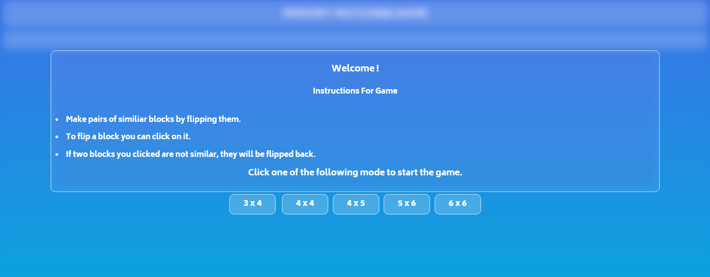

# Memory matching game

## <b> [Click here to Play the GAME!!](https://rishav-iitr29.github.io/Memory-Matching-Game/)

This project is made using HTML,CSS &amp; JavaScript.

It's a simple online memory matching game, which contains various levels.
 
Here are some snapshots from game.

  
